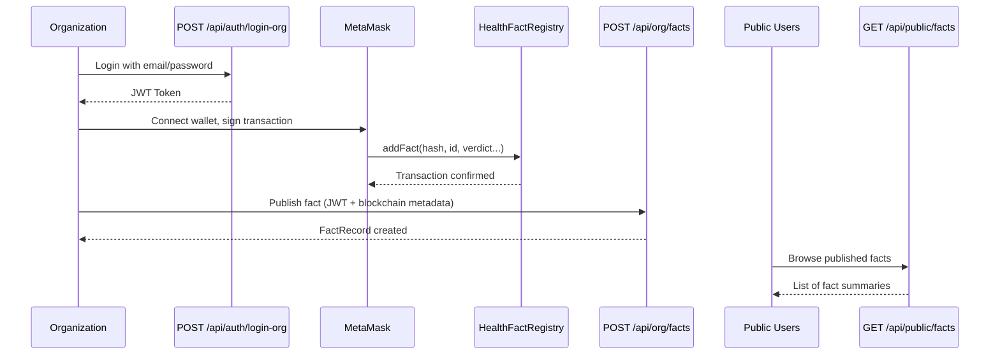

# Phase 2 Complete: Backend Fact Storage API ✅

## What Was Implemented

### 🗄️ Database Model

**File**: `backend/app/models/fact_record.py`

Created `FactRecord` table with:
- `id` (Primary Key)
- `org_id` (Foreign Key → Organization)
- `fact_id` (Unique, indexed - e.g., "who-2025-0001")
- `claim_text` (The health claim)
- `verdict` (true/false/misleading/unproven/partially_true)
- `severity` (low/medium/high/critical)
- `summary` (Explanation)
- `topics` (JSON array)
- `evidence` (JSON array of evidence objects)
- `on_chain_hash` (SHA-256 hash from blockchain)
- `tx_hash` (Ethereum transaction hash)
- `block_number` (Block where tx was mined)
- `issued_at` (WHO issuance timestamp)
- `created_at` (DB record creation timestamp)
- **Relationship**: `organization` (bi-directional link to Organization model)

### 📋 Pydantic Schemas

**File**: `backend/app/schemas/fact.py`

Created schemas:
- `EvidenceItem` - Single evidence source with URL, title, checksum
- `FactPublishRequest` - Full WHO fact JSON + blockchain metadata
- `FactRecordResponse` - Complete fact details with org name
- `PublicFactSummary` - Minimal fact info for list view
- `PublicFactListResponse` - Paginated list with total count

### 🛣️ API Endpoints

**File**: `backend/app/api/org_facts.py`

**POST** `/api/org/facts` 🔐 **Auth Required**
- Publishes a fact to the database after blockchain transaction
- Validates verdict and severity enums
- Prevents duplicate fact_id and on_chain_hash
- Returns complete fact record with org name
- **Use case**: Called by frontend after successful MetaMask transaction

**GET** `/api/public/facts` 🌐 **Public**
- Browse all published facts with pagination
- Query params: `limit`, `offset`, `verdict`, `severity`, `org_id`
- Returns list of fact summaries with org attribution
- Default: 50 results, ordered by most recent
- **Use case**: Public "Browse Statements" page

**GET** `/api/public/facts/{fact_id}` 🌐 **Public**
- Get complete details for a single fact
- Includes full summary, evidence list, topics, blockchain metadata
- Returns 404 if fact_id not found
- **Use case**: Public fact detail page

---

## 🧪 Testing Phase 2

### Test Flow

1. **Register & Login** (from Phase 1):
   ```bash
   # Register
   curl -X POST http://localhost:8000/api/auth/register-org \
     -H "Content-Type: application/json" \
     -d '{"name":"WHO","email":"test@who.int","password":"password123"}'
   
   # Login
   curl -X POST http://localhost:8000/api/auth/login-org \
     -H "Content-Type: application/json" \
     -d '{"email":"test@who.int","password":"password123"}'
   ```

2. **Publish a Fact** (use token from login):
   ```bash
   curl -X POST http://localhost:8000/api/org/facts \
     -H "Authorization: Bearer {your_token}" \
     -H "Content-Type: application/json" \
     -d '{
       "fact_id": "who-2025-test-001",
       "claim_text": "Test health claim",
       "verdict": "false",
       "severity": "high",
       "summary": "This is a test fact for demonstration",
       "topics": ["testing", "demo"],
       "evidence": [
         {
           "url": "https://example.com",
           "title": "Test Evidence",
           "accessed_at": "2025-01-29T10:00:00Z"
         }
       ],
       "issued_at": "2025-01-29T10:00:00Z",
       "on_chain_hash": "0xabc123...(64 hex chars)",
       "tx_hash": "0xdef456...(64 hex chars)",
       "block_number": 12345
     }'
   ```

3. **Browse Published Facts** (no auth needed):
   ```bash
   curl http://localhost:8000/api/public/facts
   curl http://localhost:8000/api/public/facts?verdict=false
   curl http://localhost:8000/api/public/facts?severity=high&limit=10
   ```

4. **Get Fact Details**:
   ```bash
   curl http://localhost:8000/api/public/facts/who-2025-test-001
   ```

---

## 📊 Files Created/Modified

### Created (3 files)
| File | Lines | Purpose |
|------|-------|---------|
| `backend/app/models/fact_record.py` | 50 | FactRecord SQLAlchemy model |
| `backend/app/schemas/fact.py` | 160 | Pydantic request/response schemas |
| `backend/app/api/org_facts.py` | 220 | Fact publishing & browsing endpoints |

### Modified (2 files)
| File | Changes |
|------|---------|
| `backend/app/main.py` | +imports, +router, +endpoint docs |
| `C:\...\task.md` | Phase 2 tasks marked complete |

---

## ✅ Phase 2 Checklist

- [x] FactRecord model with SQLAlchemy
- [x] Foreign key relationship to Organization
- [x] Blockchain metadata fields (hash, tx_hash, block_number)
- [x] Pydantic schemas for all requests/responses
- [x] POST /api/org/facts (auth required)
- [x] GET /api/public/facts (public, with filters & pagination)
- [x] GET /api/public/facts/{fact_id} (public, detailed view)
- [x] Verdict & severity validation
- [x] Duplicate prevention (fact_id & hash)
- [x] Organization name in responses

---

## 🔄 Complete Workflow



---

## 🎯 What's Next: Phase 3-6

**Phase 3**: Frontend Organization Auth UI
- React login/register pages
- JWT storage & auth context
- Protected routes

**Phase 4**: Wallet Connection (wagmi + MetaMask)
- Configure wagmi for Somnia Testnet
- Connect/disconnect wallet button
- Save wallet address to backend

**Phase 5**: Statement Publishing Form
- New statement form with WHO fact fields
- Canonical JSON hashing
- Contract write call via wagmi
- Submit metadata to POST /api/org/facts

**Phase 6**: Public Statements Page
- Browse all published facts
- Fact detail view with blockchain explorer links
- "On-chain Verified" badges

---

## 🔒 Security & Validation

✅ JWT authentication for publishing  
✅ Enum validation (verdict & severity)  
✅ Duplicate prevention (fact_id & hash unique constraints)  
✅ SQL injection protection (SQLAlchemy ORM)  
✅ Public endpoints accessible without auth  
✅ Organization attribution in all responses  

---

**Phase 2 Status**: ✅ **COMPLETE**

Backend is now ready to:
1. Accept fact publications from authenticated organizations
2. Serve published facts to the public
3. Support filtering and pagination for browsing

Ready to proceed to **Phase 3** (Frontend Auth UI) or test Phase 2 endpoints first!
