# WHO On-Chain Verification Layer - Phase 1 & 2 Summary

## ✅ Completed Deliverables

### Phase 1: WHO Fact JSON Schema + Sample Records

**Created Files**:
1. **`backend/app/schemas/who_fact_schema.json`** - Formal JSON Schema (Draft-07)
2. **`backend/app/data/who_facts/who-2025-0001.json`** - Sample WHO fact: COVID hot water myth
3. **`backend/app/data/who_facts/who-2025-0002.json`** - Sample WHO fact: Turmeric cancer cure myth

---

### Phase 2: Solidity Smart Contract

**Created File**:
1. **`contracts/HealthFactRegistry.sol`** - Smart contract for Somnia Testnet

---

## 📋 WHO Fact JSON Schema Overview

The schema defines a standardized format for WHO-verified health facts with the following structure:

### Required Fields

| Field | Type | Description | Example |
|-------|------|-------------|---------|
| `id` | string | Unique WHO identifier | `"who-2025-0001"` |
| `claim_text` | string | The health claim being verified | `"Drinking hot water cures COVID-19"` |
| `verdict` | enum | Verification result | `"true"` \| `"false"` \| `"misleading"` \| `"unproven"` \| `"partially_true"` |
| `severity` | enum | Public health impact | `"low"` \| `"medium"` \| `"high"` \| `"critical"` |
| `summary` | string | Explanation of verdict (50-2000 chars) | Summary text |
| `evidence[]` | array | Sources with checksums | Array of evidence objects |
| `topics[]` | array | Health topic tags | `["covid-19", "myth-debunking"]` |
| `issued_at` | ISO 8601 | When fact was issued | `"2025-01-15T12:00:00Z"` |
| `last_reviewed_at` | ISO 8601 | Last review timestamp | `"2025-01-15T12:00:00Z"` |
| `version` | integer | Version number (≥1) | `1` |
| `status` | enum | Lifecycle status | `"active"` \| `"superseded"` \| `"withdrawn"` |

### Evidence Object Structure

```json
{
  "url": "https://www.who.int/...",
  "title": "WHO COVID-19 Myth Busters",
  "checksum": "a1b2c3d4e5f6...",  // SHA-256 hash
  "accessed_at": "2025-01-15T10:30:00Z"
}
```

---

## 📄 Sample WHO Facts

### Sample #1: COVID Hot Water Myth

```json
file:///d:/Projects/health%20ai/health%20ai/backend/app/data/who_facts/who-2025-0001.json
```

**Claim**: "Drinking hot water or warm beverages can cure or prevent COVID-19 infection"

**Verdict**: `false`  
**Severity**: `high`  
**Evidence Sources**: 2 WHO documents  
**Topics**: covid-19, infectious-diseases, myth-debunking, prevention

---

### Sample #2: Turmeric Cancer Cure Myth

```json
file:///d:/Projects/health%20ai/health%20ai/backend/app/data/who_facts/who-2025-0002.json
```

**Claim**: "Turmeric can cure cancer and is as effective as chemotherapy"

**Verdict**: `misleading`  
**Severity**: `critical`  
**Evidence Sources**: 3 sources (WHO, IARC, NCBI)  
**Topics**: cancer, alternative-medicine, nutrition, treatment-misinformation, myth-debunking

---

## 🔐 Smart Contract Overview

### HealthFactRegistry.sol

**Solidity Version**: `^0.8.20`  
**Target Network**: Somnia Testnet (Chain ID: 50312)  
**License**: MIT

### Contract Features

#### Enums

```solidity
enum Verdict { TRUE, FALSE, MISLEADING, UNPROVEN, PARTIALLY_TRUE }
enum Severity { LOW, MEDIUM, HIGH, CRITICAL }
enum Status { ACTIVE, SUPERSEDED, WITHDRAWN }
```

#### Core Struct

```solidity
struct HealthFact {
    bytes32 factHash;       // SHA-256 of canonical JSON
    string factId;          // WHO fact ID
    Verdict verdict;        
    Severity severity;      
    uint64 issuedAt;        
    uint64 lastReviewedAt;  
    uint16 version;         
    Status status;          
    address addedBy;        // WHO authority
    uint64 addedAtBlock;    
}
```

#### Mappings

```solidity
mapping(bytes32 => HealthFact) public factsByHash;   // Primary lookup
mapping(string => bytes32) public hashByFactId;      // Secondary lookup
bytes32[] public allFactHashes;                      // Enumeration array
```

#### Access Control

- **Owner**: Deployed by WHO authority address
- **Modifiers**: 
  - `onlyOwner` - Restricts write operations
  - `factExists` / `factNotExists` - Validation guards

#### Events

```solidity
event FactAdded(bytes32 indexed factHash, string indexed factId, ...);
event FactUpdated(bytes32 indexed factHash, Status oldStatus, Status newStatus, ...);
event OwnershipTransferred(address indexed previousOwner, address indexed newOwner, ...);
```

#### Core Functions

| Function | Visibility | Description |
|----------|-----------|-------------|
| `addFact(...)` | external | Add new WHO fact (owner only) |
| `updateFactStatus(...)` | external | Update fact status (owner only) |
| `getFactByHash(...)` | external view | Query by canonical hash |
| `getFactById(...)` | external view | Query by WHO fact ID |
| `checkFactExists(...)` | external view | Boolean check + status |
| `getAllFactHashes()` | external view | Retrieve all fact hashes |
| `transferOwnership(...)` | external | Transfer WHO authority |

#### Helper Functions

- `verdictToString(Verdict)` → string
- `severityToString(Severity)` → string
- `statusToString(Status)` → string

### Validation Logic

The contract enforces:
- ✅ No duplicate fact hashes
- ✅ No duplicate fact IDs
- ✅ Version numbers ≥ 1
- ✅ Timestamps cannot be in the future
- ✅ `lastReviewedAt` ≥ `issuedAt`
- ✅ Only owner can add/update facts
- ✅ Status changes are logged via events

---

## 🔗 Integration Flow (Future Phases)

```mermaid
sequenceDiagram
    participant User
    participant Frontend
    participant Backend
    participant Blockchain
    participant AI

    User->>Frontend: Submit health claim
    Frontend->>Backend: POST /api/check_rumor
    Backend->>Backend: Canonicalize claim → SHA-256 hash
    Backend->>Blockchain: checkFactExists(hash)
    
    alt Fact exists on-chain (ACTIVE)
        Blockchain-->>Backend: HealthFact data
        Backend-->>Frontend: {on_chain_verified: true, verdict, summary}
        Frontend-->>User: ✅ WHO On-Chain Verified Badge
    else Fact not on-chain
        Backend->>AI: Fallback to AI verification
        AI-->>Backend: AI verdict + confidence
        Backend-->>Frontend: {on_chain_verified: false, verdict}
        Frontend-->>User: AI-verified result
    end
```



---

## 📊 File Structure Created

```
d:/Projects/health ai/health ai/
├── backend/
│   ├── app/
│   │   ├── data/
│   │   │   └── who_facts/
│   │   │       ├── who-2025-0001.json  ✅ NEW
│   │   │       └── who-2025-0002.json  ✅ NEW
│   │   └── schemas/
│   │       └── who_fact_schema.json    ✅ NEW
└── contracts/
    └── HealthFactRegistry.sol          ✅ NEW
```

---

## 🛡️ Security Considerations

### Smart Contract
- **Access Control**: Only contract owner (WHO) can add/update facts
- **Immutability**: Fact hashes cannot be changed once added
- **Status Updates**: Facts can be marked superseded/withdrawn but not deleted
- **Ownership Transfer**: Includes event logging for transparency

### Data Integrity
- **Canonical Hashing**: Will use RFC 8785 JSON canonicalization (Phase 4)
- **Evidence Checksums**: Each evidence source includes SHA-256 hash
- **Version Tracking**: All facts include version numbers
- **Audit Trail**: Blockchain events provide immutable history

---

## ⏭️ Next Steps

**Awaiting Your Review** of:

1. ✅ WHO Fact JSON Schema structure
2. ✅ Sample WHO facts content and formatting
3. ✅ Solidity contract architecture and functions

**After Approval**, I will proceed with:

- **Phase 3**: Hardhat setup + Somnia Testnet deployment
- **Phase 4**: Canonical JSON hashing + upload sample facts to chain
- **Phase 5**: Backend integration (blockchain_client.py + API updates)
- **Phase 6**: Frontend Truth Card with WHO verification badge

---

## 📝 Notes

- **Contract is NOT yet deployed** - waiting for your approval
- **Sample JSON files** use placeholder SHA-256 checksums for evidence
- **Somnia Testnet** requires STT tokens for deployment (please confirm wallet is funded)
- **Private key** will be stored in `.env` file (ensure it's in `.gitignore`)
